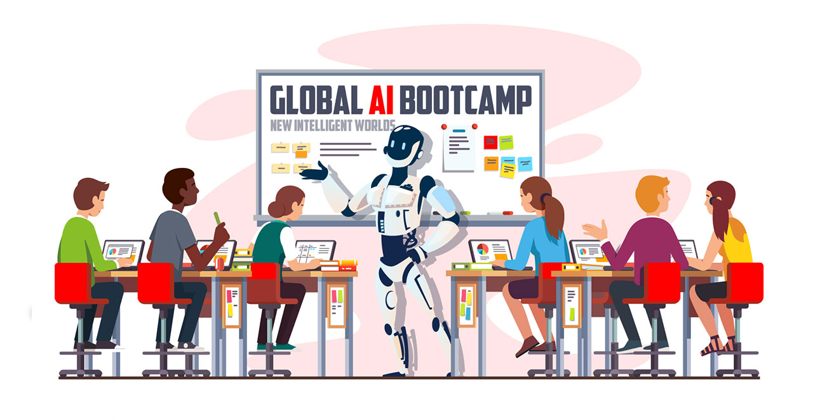
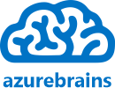
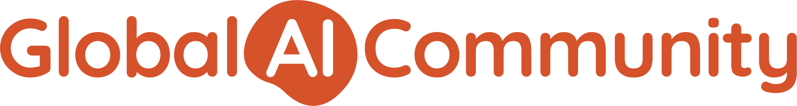
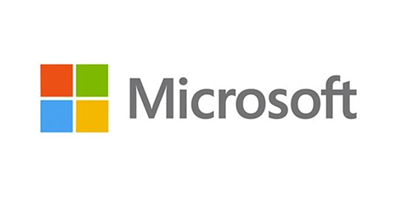
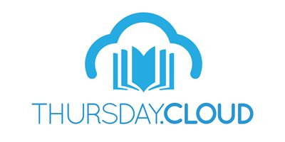
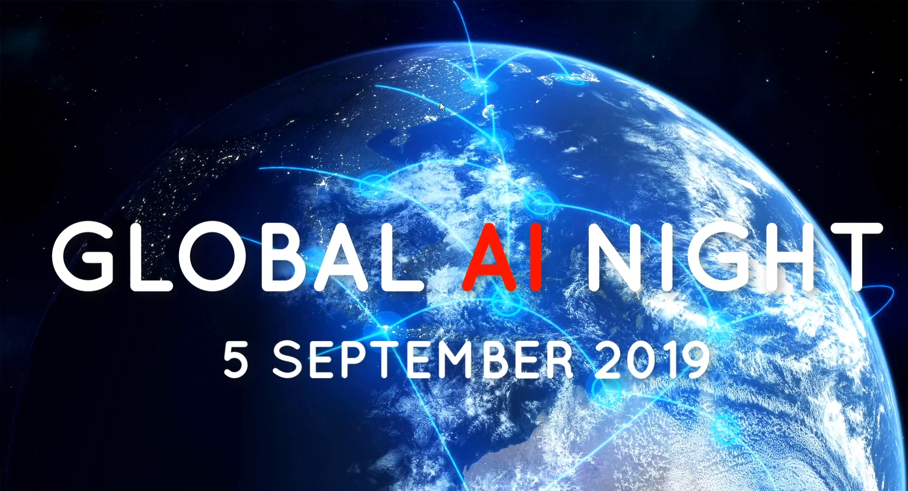

# Global AI Nights

## Global event

The Global AI Night is a free evening event organized by **94 communities** all over the world that are passionate about Artificial Intelligence on the Microsoft Azure.

During this AI Night you will get inspired through sessions and get your hands dirty during the workshops. By the end of the night you will be able to infuse AI into your applications

## Local event on Madrid hosted by Azurebrains

Azurebrains is a local community member of The Global AI Community, focused on Azure and AI technologies.

If you want to join or know about this local community you can enter directly through this link [Azurebrains Meetup](https://www.meetup.com/es-ES/Azurebrains/) and also check our blog at [Azurebrains blog](https://www.azurebrains.com).

Also if you want to know more about [Global AI Community](https://globalai.community/) you can click on this link [Global AI Community Meetup](https://www.meetup.com/es-ES/pro/the-global-ai-community).

### Local Sponsors 
Special thanks to our local sponsors who have brought us goodies for the attendees, lend us their offices and many pizzas!

### Global Sponsors

## Follow us
You can follow this event through social networks and social tools:

- Realtime global social map on **`walls.io`** -> https://walls.io/tpf5h
- **Twitter**: 
    - Handles: [@Glob_AIBootcamp](https://twitter.com/Glob_AIBootcamp), [@azurebrains](https://twitter.com/azurebrains)
    - HHasgtags: [#GlobalAINight](https://twitter.com/search?q=%23GlobalAINight), 
[#GlobalAIBootcamp](https://twitter.com/search?q=%23GlobalAINight)

# Keynote

The global organization wants to offer you this emotional Keynote in which some organizers and the Microsoft team are involved.

We want to congratulate and thank everyone for this video (in order of appearance):
- [Tim Scarfe](https://twitter.com/ecsquendor)
- [Tess Ferrandez](https://twitter.com/TessFerrandez)
- [Vlad Iliescu](https://twitter.com/vladiliescu)
- [Damian Brady](https://twitter.com/damovisa)
- [Bruno Campuano](https://twitter.com/elbruno)
- [Galiya Warrier](https://twitter.com/galiyawarrier)
- [Marian Dragt](https://twitter.com/mariandragt)
- [Matthew Renze](https://twitter.com/MatthewRenze)
- [Henk Boelman](https://twitter.com/hboelman)
- [Amy Boyd](https://twitter.com/AmyKateNicho)
- [Seth Juarez](https://twitter.com/sethjuarez)
- [Eric Boyd](https://twitter.com/eric_boyd)
- [Leila Etaati](https://twitter.com/leila_etaati)
- [Has Altaiar](https://twitter.com/hasaltaiar)

# Workshops

## Beginner Track

### LAB 01 - Creating applications that can see, hear, speak or understand - using Microsoft Cognitive Services (1 hour)

In this workshop you will be introduced to the Microsoft Azure Cognitive Services, a range of offerings you can use to infuse intelligence and machine learning into your applications without needing to build the code from scratch. We will cover pre-trained AI APIs, such as computer vision and text analytics, that are accessed by REST protocol. Next we will dive into Custom AI that uses transfer learning - Microsoft Azure Custom Vision. This enables you to provide a small amount of your own data to train an image classification model. Wrapping the workshop up by building our custom trained AI into an application - using Logic Apps, this technology is ideal for building data pipeline processes that work with your machine learning models.

#### Materials
- [Github AI Nights Content - Beginner](https://github.com/Alejandrolmeida/GlobalAINight2019/tree/master/Labs/Lab01)

#### Pre-requisites for your machine
- Clone these repositories to your local machine to gain images and code samples you need for the demos: git clone [https://github.com/Alejandrolmeida/GlobalAINight2019.git](https://github.com/Alejandrolmeida/GlobalAINight2019.git)
- Microsoft Azure Subscription - get a free trial [here](https://azure.microsoft.com/en-gb/free/)
- Laptop with a modern web browser (Google Chrome, Microsoft Edge)
- Postman, API Development Environment - [available on Windows, Linux and macOS](https://www.getpostman.com/)
- _[BONUS SECTION] Download docker for your local machine - [available on Windows, Linux and macOS](https://docs.docker.com/v17.09/engine/installation/)_

> All demos and content have been tested on a Windows PC, however all options should run from macOS and Linux machines as well. Please provide information via an issue or pull request if you have feedback on other operating systems

## Intermediate Track

### LAB 02 - Crash course on building and accelerating deep learning solutions (1 hour)

Learn the end to end process of building deep learning solutions from experimentation to deployment. We will start by experimenting locally with different model architectures and hyperparameters using PyTorch. Then, we’ll show you how to use Azure Machine Learning service to train models at massive scale in the cloud and seamlessly deploy them into production.

#### Materials
- [Github AI Nights Content - Intermediate](https://github.com/Alejandrolmeida/GlobalAINight2019/tree/master/Labs/Lab02)

## Global Support

From our community we want to recognize the great effort of all the community organizers that make this content and this global event possible.

The laboratories collected in this repository are an adaptation of the original content of [Amy Boyd](https://github.com/amynic) and [Seth Juarez](https://github.com/sethjuarez).

If you wish you can check the original repositories:
- [Original content Lab01](https://github.com/amynic/AINights) 
- [Original content Lab02](https://github.com/sethjuarez/pytorchintro)
- [Original content all materials](https://github.com/GlobalAICommunity/GlobalAINight-September-2019)